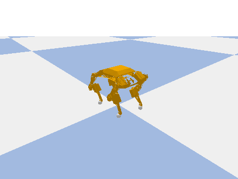

# Teaching a robot dog to walk

A complete, working reinforcement learning project: train a policy in
simulation, then run it on a real [Petoi Bittle](https://www.petoi.com/) — a
$300 robot quadruped the size of a paperback.

Nothing here is a toy. This code trained a policy that walks on real hardware.
It is small enough to read in an afternoon.



```
contract.py     ← the agreement between simulation and reality. Read first.
training/       ← the simulator, the reward, and PPO
robot/          ← the serial cable and the deployment loop
firmware/       ← the ~60 lines of C that make the robot RL-controllable
```

---

## 1. What reinforcement learning is

Supervised learning needs a teacher: thousands of examples with the right
answer attached. For walking, nobody has the right answers. What angle should
the front-left knee be at, 0.35 seconds into a stride? No one can say.

Reinforcement learning replaces the teacher with a **score**. You do not say
what to do; you say what is *good*. Then something tries, mostly fails, and
gradually does more of whatever scored well.

The loop is the whole idea:

```
         ┌──────────────────────────────────────────────┐
         │                                              │
         ▼                                              │
   ┌───────────┐   action    ┌─────────────┐            │
   │   AGENT   │ ──────────► │ ENVIRONMENT │            │
   │           │             │             │            │
   │  policy   │ ◄────────── │   physics   │ ───────────┘
   └───────────┘  observation└─────────────┘   reward
                  (246 numbers)                (one number)
```

Twenty times a second: the agent looks at the world, picks an action, the
world changes, and a number comes back saying how that went.

### The six words

| Word | Here | Where |
|---|---|---|
| **Environment** | The simulated robot and the floor | `training/env.py` |
| **State** (observation) | 246 numbers the robot can sense | `contract.py` |
| **Action** | 8 numbers: how far to move each joint | `contract.py` |
| **Reward** | One number per step: was that good? | `training/env.py` |
| **Policy** | The network turning state into action | `training/train.py` |
| **Agent** | The policy *plus* what improves it (PPO) | `training/train.py` |

An **episode** is one attempt: 200 steps, 10 seconds of robot time, ending
early if the robot falls. Training runs about 50,000 of them.

---

## 2. The three things you must define

Every RL problem comes down to these. Get one wrong and nothing works — and
the failure will not look like the thing you got wrong.

### The state: what can it actually sense?

The Bittle's honest sensor list is short:

- An **IMU** — orientation (which way is up) and acceleration.
- That is it.

No joint encoders. No foot sensors. No camera. No idea where it is in the room.

So the observation is:

```
[ 6 body values ] + [ 30 past joint poses × 8 joints ] = 246 numbers
```

The 6 body values are orientation as a quaternion plus two acceleration
channels. The other 240 are a rolling log of the last 30 commands.

**Why a history?** The policy is a plain feed-forward network — it has no
memory. Walking is periodic; to know whether to lift or plant a foot you have
to know what you just did. The history *is* the memory, stapled onto the input.

This matters because of the **Markov property**, the assumption underneath all
of RL: the state must contain everything needed to choose well. A single
snapshot of joint angles does not — the same pose occurs going up and coming
down, and it needs opposite actions. Adding history restores it.

**And notice what the history really is.** It records what we *commanded*, not
where the legs went. Nothing on this robot can measure a joint's true position.
If a servo stalls against the floor, the observation never mentions it. This is
the single biggest reason a simulator-trained gait degrades on hardware, and
you cannot fix it in software.

### The action: what can it do?

8 numbers in `[-1, +1]`, one per leg joint. They are **changes**, not angles:

```python
new_angle = current_angle + action * 5°      # contract.apply_action
```

Why relative? Two real reasons:

- **It bounds speed.** 5° per decision × 20 decisions/second = 100°/s maximum.
  Real servos top out near 240°/s, so an absolute action space lets the policy
  learn a gait the hardware silently cannot execute. This makes it unlearnable.
- **Holding still is easy.** Output zero and nothing moves. With absolute
  angles, "hold" means reproducing the exact current angle every step, and
  small errors become jitter.

### The reward: what does good mean?

This is where you will spend your time, and where it goes wrong.

The goal is "walk forward slowly while standing up". The reward has ~18 terms
(`training/env.py`), but the shape that matters is one line:

```python
forward_reward = W_FORWARD * height_gate * speed_match
```

Note the **multiply**. An earlier version added those terms. Within an hour,
the policy discovered it could flop on its belly, abandon the height reward
entirely, and shovel itself along — scoring *better* than walking, because
walking risks falling and flopping does not.

Multiplying makes them inseparable. At belly height the gate is near zero, so
forward progress is worth near zero however fast you go. **You cannot buy speed
by giving up posture.** Gating a reward on a precondition rather than adding
to it is a trick worth keeping.

---

## 3. How the learning works (PPO)

**Proximal Policy Optimization.** Two phases, forever:

**Collect.** Run the current policy for ~16,000 steps across 10 parallel
simulators, writing down every (state, action, reward). Nothing learns yet.

**Update.** For each action taken, ask: did that turn out better or worse than
expected? Make the better-than-expected ones more likely. Then throw the data
away — it came from the old policy and is stale the instant the policy moves.

### "Than expected" needs a second network

So PPO trains a **critic** alongside the policy, predicting the total future
reward from a state.

```
advantage = (what actually happened) − (what the critic predicted)
```

Positive advantage → do more of that. The critic is a measuring stick, thrown
away at deployment: `robot/run.py` loads only the policy.

### What "proximal" means

The obvious version of the update is unstable. One lucky rollout suggests a big
change, the policy lurches somewhere it has never been, collects garbage, and
the run collapses — with the good policy already overwritten.

PPO **refuses to move far**. Each update is clipped so the new policy stays
close to the old one. Slower climb, no cliff.

That is the whole reason PPO dominates robotics. It is not the fastest learner.
It is the one that does not blow up overnight while you sleep.

### The knobs

| Knob | Does what | If wrong |
|---|---|---|
| `learning_rate` (1e-4) | Step size per update | Too high: thrashes. Too low: never arrives |
| `target_kl` (0.05) | Hard cap on policy change | Too tight and updates abort at step 0 — we lost 84% of a run to `0.03` |
| `ent_coef` (0.005) | Pays the policy to stay random | At 0 it locks onto the first mediocre thing that works |

`ent_coef` is the **explore/exploit** dial, RL's oldest tension. Exploit what
works, and you never find what works better. Explore forever, and you never
cash in. Early on, exploration is everything.

---

## 4. Simulation, and why it lies

Training takes ~10 million steps. On the real robot at 20 Hz that is **139
hours** of continuous walking — on servos that overheat, a battery lasting 45
minutes, with a human resetting the robot after every fall.

The simulator does it in about 35 minutes.

That is the bargain, and the catch is that **the simulator is not reality**.
The gap is where policies die, and it is the actual subject of this project.

### The contract

Sim and hardware are different programs. A policy only transfers if they agree
exactly on what an action means, what an observation is, and where an episode
starts. So those are defined **once**, in `contract.py`, and both import them.

Neither is allowed its own opinion. That makes a whole class of bug impossible
to write — which matters more than it sounds, because these bugs do not crash.

### The sign bug

The one that cost the most. The firmware flips the sign for servos on the
robot's right side, because they are mounted facing the other way:

```c
duty = calibratedZeroPosition[i] + angle * rotationDirection[i];
```

Meaning: on the real robot, sending the **same** number to a left/right pair
produces a **mirrored** pose. The simulator did not apply that flip. Its model
used opposite signs for symmetry.

Both looked perfectly correct in isolation. In simulation the robot walked. On
hardware the same policy sent one leg swinging out while its mirror tucked in.

Nothing crashed. Nothing warned. It just did not work, and the natural
assumption was that the reward needed tuning. **Weeks** went into reward
shaping before anyone checked the sign convention.

The lesson is not about signs. It is that sim-to-real bugs are silent — the
policy will confidently do the wrong thing — and that a shared, tested contract
is worth far more than it costs.

### Making the simulator worse on purpose

Three deliberate handicaps:

| Handicap | Why |
|---|---|
| Servo torque set to 0.14 N·m, *below* the real stall torque | Real servos sag under the robot's weight. Sim held poses rigidly, so the policy learned gaits with no sag margin and the knees scraped in reality |
| Joint speed capped at 4.2 rad/s | The servo's real top speed. Otherwise the policy learns motion nothing can execute |
| Angles rounded to whole degrees | The serial packet carries integer bytes — so train on the same quantized angles the robot will actually receive |

**When reality is worse than your model, degrade the model.** Do not hope.

And the limits in `contract.py` are the *measured* ones — where the leg hits the
plastic shell — not the firmware's permissive software limits. Both sides clip
identically, so the policy never explores a pose reality refuses to produce.

---

## 5. Run it

Full setup is in **[QUICKSTART.md](QUICKSTART.md)**. The short version — you
need two machines, and neither needs the other's dependencies:

**Train in Colab.** Upload `colab_train.ipynb`, `Runtime -> Run all`. It
installs, trains, shows you a GIF of what you built, and hands you a `walk.zip`.
Budget ~12 min for 300k steps, ~40 min for 1M.

**Run on your laptop.** Only needs prebuilt wheels — nothing compiles:

```bash
pip install -r requirements-robot.txt
sudo usermod -aG dialout $USER    # one time, then log out and back in
python robot/link.py                            # sensors only, moves nothing
python robot/run.py robot/policies/walk_v9.zip  # walks
```

`walk_v9.zip` ships with the repo and already works on hardware, so you can
watch the robot walk before training anything.

**Check your work anywhere.** Every file self-tests:

```bash
python contract.py        # the contract is consistent
python training/env.py    # the robot stands, the reward is not exploitable
```

## 6. Things worth trying

Ordered by **how quickly you see the effect**, because training time is the
scarce resource. The first three show up in a 300k-step run (~12 min in Colab).

1. **Change `TARGET_SPEED_MS`** to `0.0`. You have just asked the robot to
   stand perfectly still. It should stop trying to walk almost immediately —
   the fastest way to prove to yourself that the reward really is in charge.
2. **Set `FALL_PENALTY = 0.0`.** Falling is now free. Watch how quickly the
   policy stops caring about staying upright.
3. **Raise `W_EFFORT` from 0.03 to 1.0.** Moving is now expensive. The policy
   should go rigid and barely twitch.
4. **Set `ent_coef=0`** on the training command line. Watch it converge fast to
   something mediocre and stop looking.
5. **Delete the joint history** (`JOINT_HISTORY_LEN = 1` in `contract.py`). It
   can no longer tell where it is in a stride. Needs a longer run to show.
6. **Break the contract deliberately** — flip one sign in `ROTATION_DIRECTION`
   and watch a good policy fail in a way that looks exactly like a reward
   problem. Then try to find it. This is the most honest exercise here.

### One that does *not* work at short budgets

The obvious experiment — change `height_gate *` to `height_gate +` in the
forward reward, expecting the robot to learn to crawl — **was tested and does
not reproduce at 1M steps.** Measured: standard reward reached 7.9 cm body
height at 5.6 cm/s; with the gate removed, 7.7 cm at 6.3 cm/s. Visually
identical, both standing.

The reason is worth understanding, because it is a real lesson about reward
design: removing the gate decouples speed from posture, but the separate
`W_HEIGHT` term still pays 1.0 per step for standing regardless. Crawling only
wins once the policy has learned to crawl *fast*, and finding that takes far
more exploration than 1M steps buys.

To actually induce the belly-crawl, you would need to zero `W_HEIGHT` as well,
so nothing at all pays for posture — and even then, budget a long run. The
historical sprawl this project suffered (v7, see below) happened under a
different reward shape entirely, over 10M steps.

---

## 7. What this project got wrong first

Ten training runs. Roughly, in order:

| | What happened |
|---|---|
| v1–v2 | Saturated the servos, fell over. Also: `target_kl=0.03` aborted 84% of updates — the policy barely learned at all |
| v3 | Found the joint mapping was scrambled: 6 of 8 commands went to the wrong leg. It moved, so nothing crashed |
| v4 | Walked in simulation. Tipped over on hardware |
| v5 | Reward-hacked by holding one leg still and scoring the smoothness bonus |
| v6 | Mirror augmentation — the policy had learned a lopsided gait from random initialization |
| v7 | Sprawled at belly height and slid. Cause of the multiply-not-add fix |
| v8–v9 | Measured the real joint limits and stand height. **First policy that walked** |
| v10 | Weakened the simulated servos to stop the knees scraping |

Every one of v1–v7 was chasing the reward function. The bugs were in the
contract.

That is the real lesson of this repository. Reward shaping is visible,
satisfying, and endlessly tweakable, so it is where everyone looks first. The
failures that actually matter are silent, live in the boundary between your
simulator and your robot, and will patiently let you tune rewards for weeks.

---

## What is where

| File | What it is |
|---|---|
| `contract.py` | Joint order, limits, action meaning, observation format. **Start here** |
| `training/env.py` | The simulated robot: physics, reward, `reset()`/`step()` |
| `training/train.py` | PPO, the agent, the training loop |
| `training/watch.py` | Replay a policy in sim, print the reward breakdown |
| `robot/link.py` | Serial transport: find the robot, send joints, read the IMU |
| `robot/env.py` | Same interface as `training/env.py`, real robot behind it |
| `robot/run.py` | The deployment loop |
| `firmware/` | The ~60 lines of C, and why each one exists |
| `colab_train.ipynb` | Train in Colab, no local install |
| `QUICKSTART.md` | Setup for both machines, including Linux serial permissions |

Model meshes in `training/model/` are derived from the
[AIWintermuteAI Bittle CAD reconstruction](https://github.com/AIWintermuteAI/Bittle_URDF) (GPL-3.0).
